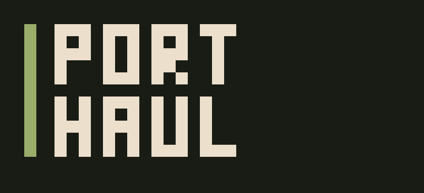

# PORTHAUL



**wireless file haul for 3DS.** an FTP server **and** client in one app — push and pull
files between your console, phone, and PC over Wi-Fi. no cables, no card readers.

> a reworked fork of [ftpd](https://github.com/mtheall/ftpd) by Michael Theall,
> Dave Murphy & TuxSH (GPLv3) — with an added FTP client, a touch file manager,
> QR connect, and a refreshed look.

---

## what it does

- **SERVER** — your phone / PC connect *to* the 3DS to drop or grab files (classic ftpd).
- **CLIENT** — the 3DS connects *out* to another FTP server (phone / PC / NAS) to **browse,
  download, and upload**. runs on a background thread, so the UI never blocks.
- **CONNECT (QR)** — point your phone camera at the on-screen QR to connect instantly.
- **FILE MANAGER** — browse the SD card on the bottom screen by touch: open folders,
  **new folder / rename / delete**.

## controls (3DS)

| input | action |
|-------|--------|
| **L / R** | switch tabs (SERVER / CLIENT / CONNECT) |
| **left stick** | scroll the log (top screen) |
| **touch / stylus** | navigate lists, drag to scroll, tap fields to type |
| **double-tap a folder** | open it |
| **Y** | menu (Settings / About / Quit) |
| **START** | exit |

## usage

**Pull files from your phone → 3DS**
1. on the phone, start any FTP **server** app (e.g. "FTP Server", or CX File Explorer → network access). note its `ip:port` / user / pass.
2. on the 3DS, switch to **CLIENT** (L/R), enter the host (no `ftp://`), port (often `2121`, *not* 21), user & pass on the bottom screen, hit **CONNECT**.
3. browse, select a file, **DOWNLOAD** (lands on `sdmc:/`). to send a file the other way,
   pick it on the **SERVER** tab's file list, then **UPLOAD** from the client.

**Send files from your phone → 3DS**
1. on the 3DS, the **SERVER** tab is already serving.
2. on the phone, open an FTP **client**, scan the **CONNECT** QR or type the IP, transfer.

## build

Requires devkitPro with the 3DS toolchain and these portlibs:
`3ds-zlib 3ds-curl 3ds-mbedtls 3ds-jansson 3ds-libzstd`.

```sh
export DEVKITPRO=/opt/devkitpro DEVKITARM=/opt/devkitpro/devkitARM
export PATH=$DEVKITPRO/tools/bin:$DEVKITARM/bin:$PATH
cmake -B build -DCMAKE_TOOLCHAIN_FILE=$DEVKITPRO/cmake/3DS.cmake -DCMAKE_BUILD_TYPE=Release
cmake --build build -j4
# -> build/porthaul.3dsx
```

## credits & license

PORTHAUL is GPLv3, inherited from ftpd. The FTP engine (RFC 959 / 3659), MODE Z, and the
platform layers are by **Michael Theall, Dave Murphy, and TuxSH**. Bundled libraries
(Dear ImGui, libcurl, zlib, mbedTLS, jansson, Nayuki qrcodegen) keep their own licenses —
see the in-app **About** screen for full attribution.
